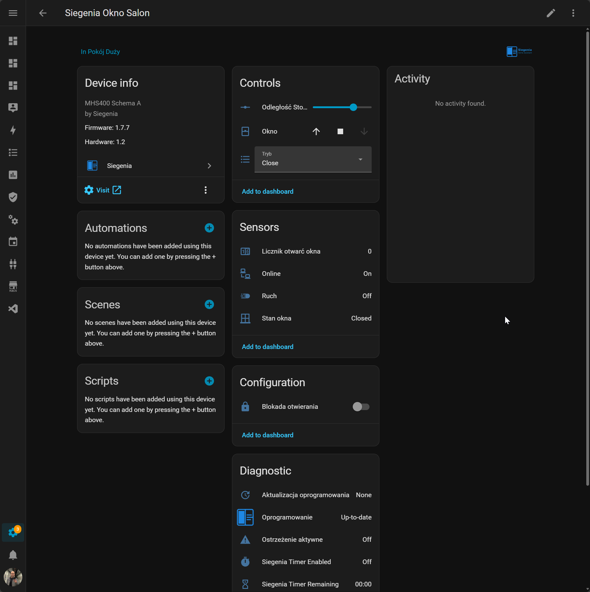

# Siegenia for Home Assistant

[](https://hacs.xyz/)
[](https://github.com/EvotecIT/homeassistant-siegenia/actions/workflows/ci.yml)
[](https://github.com/EvotecIT/homeassistant-siegenia/actions/workflows/hassfest.yml)

Local Siegenia support for Home Assistant, focused on MHS-family controllers and a practical, polished Home Assistant experience.



## 🎯 What This Is

This custom integration connects Siegenia window controllers to Home Assistant using the local device API.

It is designed to be:

- local and private
- responsive
- GUI-configurable
- friendly for dashboards, automations, and daily use

## ✨ What You Get

- config flow setup
- cover control for open, close, stop, and mode-style actions
- sensors, binary sensors, update entity, buttons, numbers, and selects
- device automations and helpful services
- diagnostics and push-style behavior where available

## 🏠 Installation

### HACS

1. Open HACS.
2. Add this repository as a custom repository of type `Integration`.
3. Install `Siegenia`.
4. Restart Home Assistant.
5. Add `Siegenia` from `Settings -> Devices & services`.

### Manual

1. Copy the `custom_components/siegenia` folder into your Home Assistant `config/custom_components` directory.
2. Restart Home Assistant.
3. Add the integration from `Settings -> Devices & services`.

## ⚙️ Configuration

You will usually need:

- host or IP
- username
- password
- default secure WebSocket connection settings

The integration also includes options for reconnect behavior, discovery helpers, polling, heartbeat, warnings, and dashboard-oriented behavior.

## 🪟 Main Features

- window control through Home Assistant `cover`
- extra mode actions such as gap vent, close without lock, and stop over
- optional opening lock behavior
- timer support
- warning events and notifications
- blueprints and dashboard examples

## 🧱 Project Structure

This repo is intentionally split into two layers:

- a reusable local protocol/client layer for talking to the Siegenia controller
- the Home Assistant integration layer on top of it

That keeps the Home Assistant behavior clean while leaving the protocol side reusable and easier to test.

## 🛠️ Development

```bash
pip install -r requirements_test.txt
pytest
```

There is also a latest-stack test path documented in the repo for newer Home Assistant and Python versions.

## ❤️ Support

- Support notes: `docs/SUPPORT.md`
- Releasing notes: `docs/RELEASING.md`
- Source: [GitHub Repository](https://github.com/EvotecIT/homeassistant-siegenia)
