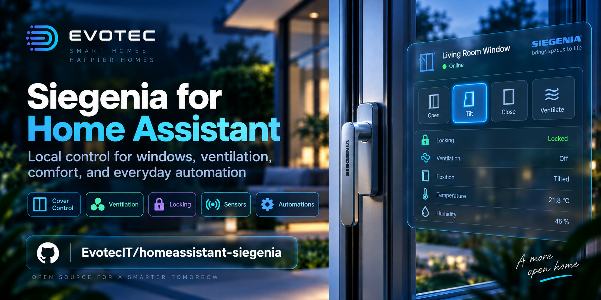
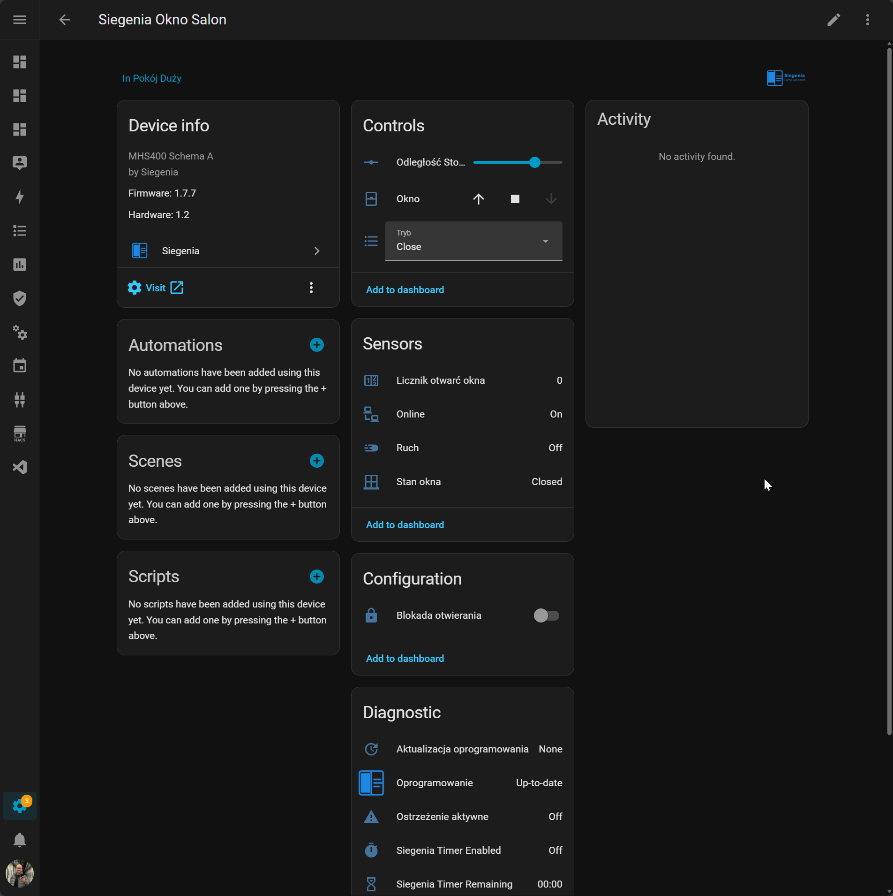

# Siegenia for Home Assistant



*Illustrative artwork. Available controls depend on the device and integration support.*

[](https://hacs.xyz/)
[](https://github.com/EvotecIT/homeassistant-siegenia/actions/workflows/ci.yml)
[](https://github.com/EvotecIT/homeassistant-siegenia/actions/workflows/hassfest.yml)

Local Siegenia support for Home Assistant, focused on MHS-family controllers and a practical, polished Home Assistant experience.



## More for your Home Assistant home

Other projects we maintain for the same setup:

- [Dreame & MOVA mowers](https://github.com/EvotecIT/homeassistant-dreamelawnmower) — mowing controls, maps, schedules, and supported cameras.
- [Lawn Mower Card](https://github.com/EvotecIT/lovelace-lawn-mower-card) — a visual dashboard for mower state, maps, and controls.
- [KEF](https://github.com/EvotecIT/homeassistant-kef) — local control for modern and legacy speaker families.
- [Devialet](https://github.com/EvotecIT/homeassistant-devialet) — local speaker control, with Dione support.
- [EasyControlX](https://github.com/EvotecIT/homeassistant-easycontrolx) — connect supported Windows and macOS hosts.

Prefer a native app for everyday control? [CasaRay](https://casaray.dev/)
brings rooms, devices, cameras, and home activity together on iPhone, iPad, and
Mac. [Tactra Remote](https://tactra.dev/) puts media players, speakers, and TV
controls in a focused remote for iPhone, iPad, Apple Watch, and Mac.

Both connect to your Home Assistant setup. Neither is required to use this
project.

## 🎯 What This Is

This custom integration connects Siegenia window controllers to Home Assistant using the local device API.

It is designed to be:

- local and private
- responsive
- GUI-configurable
- friendly for dashboards, automations, and daily use

## ✨ What You Get

- config flow setup
- cover control for open, close, stop, and mode-style actions
- sensors, binary sensors, update entity, buttons, numbers, and selects
- device automations and helpful services
- diagnostics and push-style behavior where available

## 🏠 Installation

### HACS

1. Open HACS.
2. Add this repository as a custom repository of type `Integration`.
3. Install `Siegenia`.
4. Restart Home Assistant.
5. Add `Siegenia` from `Settings -> Devices & services`.

### Manual

1. Copy the `custom_components/siegenia` folder into your Home Assistant `config/custom_components` directory.
2. Restart Home Assistant.
3. Add the integration from `Settings -> Devices & services`.

## ⚙️ Configuration

You will usually need:

- host or IP
- username
- password
- default secure WebSocket connection settings

The integration also includes options for reconnect behavior, discovery helpers, polling, heartbeat, warnings, and dashboard-oriented behavior.

### Online, offline, and connection security

- When a controller goes offline, its entities become unavailable and recover automatically after the connection returns.
- Commands made while the controller is unavailable fail clearly in Home Assistant instead of being reported as successful.
- Debug logging redacts passwords before WebSocket requests are written to the log.
- Secure WebSockets (`wss`) are the default. Certificate verification is optional because many controllers use a self-signed certificate. Enable verification when the controller certificate and hostname are trusted; otherwise keep the controller and Home Assistant on a trusted local network.

## 🪟 Main Features

- window control through Home Assistant `cover`
- extra mode actions such as gap vent, close without lock, and stop over
- optional opening lock behavior
- timer support
- warning events and notifications
- blueprints and dashboard examples

## 🧱 Reusable Python Package

This repository now ships two usable layers:

- `siegenia_client` for direct Python access to the local Siegenia controller API
- the Home Assistant integration in `custom_components/siegenia`

Library docs: `docs/python-library.md`

Runnable example: `examples/python_client.py`

Example:

```python
import asyncio

from siegenia_client import SiegeniaClient


async def main() -> None:
    client = SiegeniaClient("192.168.1.30")
    await client.connect()
    try:
        ...
    finally:
        await client.disconnect()


asyncio.run(main())
```

That keeps the local protocol layer reusable for scripts or tooling while the Home Assistant integration stays focused on setup, entities, and automations.

## 🛠️ Development

```bash
python -m pip install -e .[test]
python -m compileall siegenia_client custom_components tests examples
pytest
```

CI validates supported Python lanes and a current Home Assistant stack. Merged
pull requests are released automatically through the repository release workflow.

## ❤️ Support

- Support notes: `docs/SUPPORT.md`
- Releasing notes: `docs/RELEASING.md`
- Source: [GitHub Repository](https://github.com/EvotecIT/homeassistant-siegenia)
